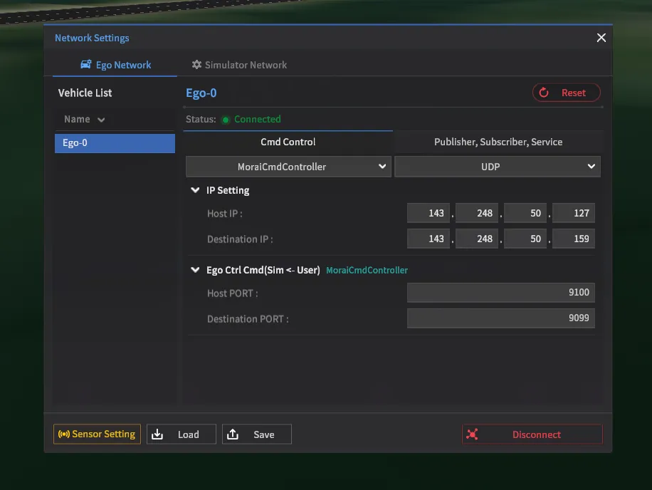

# MORAI - Network Module example (UDP)

This is an example of sending and receiving UDP data in `MORAI SIM: Drive`  
For more details, please refer to the MORAI manual.  
Link : https://help-morai-sim.scrollhelp.site/

```
├── lib                
│    ├── define          # UDP network - Protocol configure
│    └── network         # UDP network manager class│    
│
├── EgoNetwork           
│    ├── CmdControl      # Ego Vehicle Control Command
│    ├── Publisher       # UDP Protocol received from the MOARI SIM related to Ego
│    └── Subscriber      # UDP Protocol send to the MOARI SIM related to Ego
│
├── Sensor              
│
└── Etc

```

# Requirement

- python >= 3.7


# 공통 setup
Please follow this part if you want to see the camera images or send commands to the simulator.
- f4눌러서 네트워크 세팅 들어가기
- 아래 보이는 건 예시임. 사용자에 맞게 ip세팅하기
    - host IP에는 시뮬레이터를 돌리는 윈도우/우분투 ip
    - destination ip에는 e2e 알고리즘 돌리는 서버 ip 넣기
    - port는 상관 없음. 두 값이 중복되지만 않으면 괜찮음
    

# 카메라 영상 보기
Single Camera: please refer to [get camera guide](./guide/get_camera_single.md)
Multi Camera: refer to [get multi view camera guide](./guide/get_camera_multi.md)
* multi camera code does not support Bounding box visualizaiton

# Cmd 보내기
please refer to [send command guide](./guide/send_cmd.md)