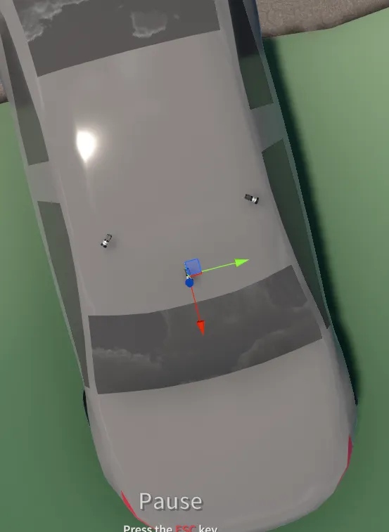
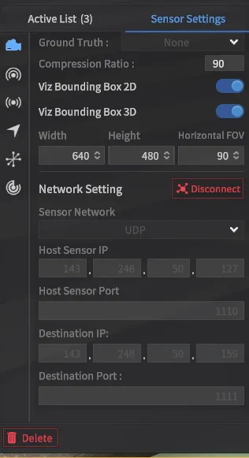

## 카메라 영상 보는 방법

# 시뮬레이터 setup
- 시뮬레이터에서 카메라 설치하기
    - f3누르기
    - 카메라 클릭하기
    - 시프트 누른 상태에서 차위 클릭하면 카메라 설치 가능
    - 아래 보이는 이미지랑 다르게 카메라 하나만 설치하면 됨
    
- 아래 보이는 것처럼 카메라 통신 정보 세팅하기
    - host 센서 아이피는 시뮬레이터 pc
    - destination ip는 카메라 보내고 싶은 곳 주소
    - 포트는 둘 다르게 하기
    

# 예제 셋업
```
pip install opencv-python
이 파일 열기 ./Sensor/Camera.py
라인 11, 12 수정하기

아래 명령어로 실행하기
python ./Sensor/Camera.py
```