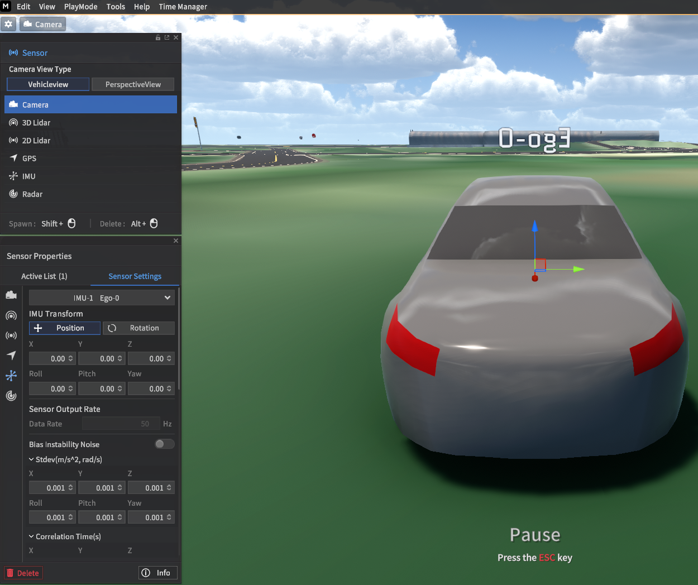
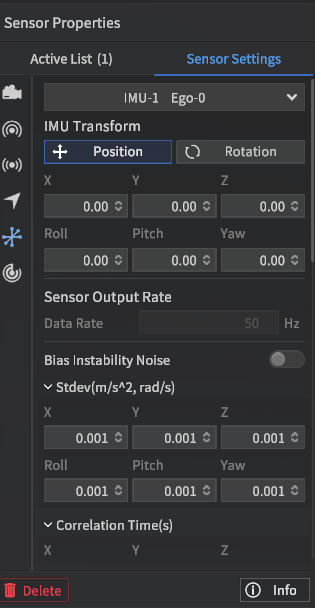
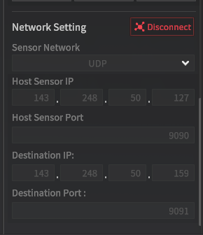

## IMU 센서로 Ego Info 보는 방법

# 시뮬레이터 setup
- 시뮬레이터에서 카메라 설치하기
    - f3누르기
    - IMU 클릭하기
    - 시프트 누른 상태에서 차위 클릭하면 카메라 설치 가능 (일단은 아무 데나 설치 ㄱㄱ) 

  

- IMU 위치 세팅하기
    - 아래 사진 처럼 x, y, z, roll, pich, yaw 모두 0으로  
  
  

- 아래 보이는 것처럼 IMU 통신 정보 세팅하기
    - host 센서 아이피는 시뮬레이터 pc
    - destination ip는 카메라 보내고 싶은 곳 주소
    - 포트는 둘 다르게 하기 (아무 값이나 상관 없음)
    - 그리고 connet 누르기

  


# 예제 셋업
```
pip install opencv-python
이 파일 열기 ./Sensor/IMU.py 
라인 9, 10 수정하기

아래 명령어로 실행하기
python ./Sensor/IMU.py 
```