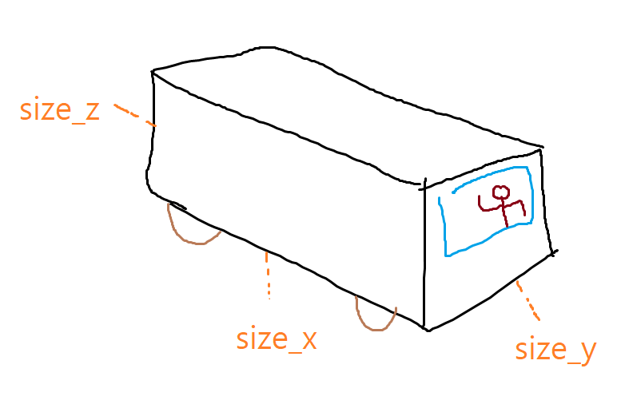

# 자동차 이미지



# 자동차 크기 관련상수
```
size_x: 6.195000171661377 # length
size_y: 2.436000108718872 # width
size_z: 2.6649999618530273 # height
overhang: 0.9900000095367432 # 앞범퍼 앞바퀴 거리
wheelbase: 3.6700000762939453 # 앞바퀴 뒷바퀴 거리
rear_overhang: 1.534999966621399 # 뒷바퀴 뒷범퍼 거리
```